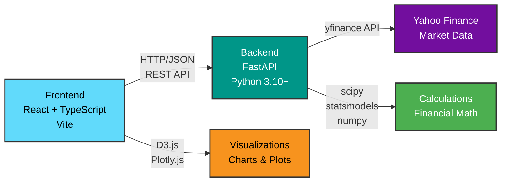

# Technical Architecture

Technical documentation for the Quantitative Strategy & Risk Dashboard.

## System Overview



**Architecture Layers:**

- **Frontend Layer:** React SPA with TypeScript, using Vite for HMR and builds
- **Backend Layer:** FastAPI async framework providing REST API endpoints
- **Data Layer:** Yahoo Finance API via yfinance library for market data
- **Visualization Layer:** D3.js (2D) and Plotly.js (3D) for interactive charts
- **Computation Layer:** Scientific Python stack (scipy, statsmodels, numpy, pandas)

## Backend Architecture

### FastAPI Application Structure

```
backend/
├── app/
│   ├── main.py                # FastAPI app initialization
│   ├── config.py              # Configuration management
│   ├── models/                # Pydantic models (request/response schemas)
│   │   ├── hrp.py            # HRP models
│   │   ├── statarb.py        # StatArb models
│   │   └── iv.py             # IV models
│   ├── routers/               # API endpoints
│   │   ├── hrp.py            # HRP routes
│   │   ├── statarb.py        # StatArb routes
│   │   └── iv.py             # IV routes
│   └── services/              # Business logic
│       ├── data_ingestion.py       # Market data fetching
│       ├── hrp_clustering.py       # Hierarchical clustering
│       ├── cointegration.py        # Engle-Granger testing
│       ├── options_data.py         # Options chain fetching
│       └── iv_calculator.py        # Black-Scholes + Newton-Raphson
├── tests/                     # Test suite (126 tests)
│   ├── unit/                 # Unit tests
│   ├── integration/          # API integration tests
│   └── validation/           # Mathematical validation tests
└── scripts/                   # Manual testing scripts
```

### Key Components

#### 1. Data Ingestion Service
- **File:** `app/services/data_ingestion.py`
- **Purpose:** Fetch historical price data from yfinance
- **Functions:**
  - `fetch_and_process_prices()` - Get adjusted close prices
  - `calculate_correlation_matrix()` - Pearson correlation
  - `fetch_prices()` - Helper for StatArb

#### 2. HRP Clustering Service
- **File:** `app/services/hrp_clustering.py`
- **Purpose:** Hierarchical Risk Parity algorithm
- **Functions:**
  - `correlation_to_distance()` - Transform correlation to distance metric
  - `perform_hierarchical_clustering()` - scipy linkage
  - `seriate_matrix()` - Reorder for block-diagonal structure
  - `linkage_to_tree_dict()` - Convert to nested JSON for D3.js

#### 3. Cointegration Service
- **File:** `app/services/cointegration.py`
- **Purpose:** Engle-Granger cointegration testing
- **Functions:**
  - `test_cointegration()` - Full Engle-Granger test
  - `calculate_spread()` - Price spread calculation
  - `calculate_zscore()` - Rolling z-score
  - `generate_trading_signals()` - Entry/exit signals

#### 4. Options Data Service
- **File:** `app/services/options_data.py`
- **Purpose:** Fetch options chain from yfinance
- **Functions:**
  - `fetch_options_chain()` - Get all options contracts
  - `get_risk_free_rate()` - Fetch 10-year Treasury rate

#### 5. IV Calculator Service
- **File:** `app/services/iv_calculator.py`
- **Purpose:** Black-Scholes-Merton pricing and IV solving
- **Functions:**
  - `black_scholes()` - BSM pricing formula
  - `vega()` - First derivative of price w.r.t. volatility
  - `calculate_implied_volatility()` - Newton-Raphson solver

### API Endpoints

#### HRP Module
```
POST /hrp/analyze
  Request: { tickers: string[], start_date: string, end_date: string, linkage_method: string }
  Response: { correlation_matrix, dendrogram, heatmap, cluster_map, metrics }

POST /hrp/correlation
  Request: { tickers: string[], start_date: string, end_date: string }
  Response: { correlation_matrix, available_tickers }
```

#### StatArb Module
```
POST /stat-arb/test-pair
  Request: { ticker1: string, ticker2: string, start_date: string, end_date: string }
  Response: { p_value, is_cointegrated, hedge_ratio, half_life, correlation }

POST /stat-arb/find-pairs
  Request: { tickers: string[], start_date: string, end_date: string, p_value_threshold: float }
  Response: { cointegrated_pairs: array, total_pairs_tested: int }

POST /stat-arb/spread-analysis
  Request: { ticker1, ticker2, start_date, end_date, entry_threshold, exit_threshold }
  Response: { spread, zscore, signals, statistics }
```

#### IV Module
```
GET /iv/surface/{ticker}
  Query Params: expiration_filter, min_volume
  Response: { calls, puts, spot_price, risk_free_rate, metrics }
```

## Frontend Architecture

### React Application Structure

```
frontend/
├── src/
│   ├── App.tsx                   # Main app component with routing
│   ├── main.tsx                  # React entry point
│   ├── components/               # Reusable components
│   │   ├── Layout.tsx           # Header, nav, footer
│   │   ├── Dendrogram.tsx       # D3.js dendrogram
│   │   ├── Heatmap.tsx          # D3.js correlation heatmap
│   │   ├── PairsTable.tsx       # Sortable pairs table
│   │   ├── SpreadChart.tsx      # D3.js dual-axis chart
│   │   ├── IVSummaryCards.tsx   # IV metrics cards
│   │   ├── IVDataTable.tsx      # Options data table
│   │   ├── IVSurfaceChart3D.tsx # Plotly.js 3D scatter
│   │   ├── TickerAutocomplete.tsx        # Single-select autocomplete
│   │   └── MultiTickerSelect.tsx         # Multi-select autocomplete
│   ├── pages/                    # Page components
│   │   ├── Dashboard.tsx        # Landing page
│   │   ├── HRPAnalysis.tsx      # HRP module
│   │   ├── StatArbAnalysis.tsx  # StatArb module
│   │   └── IVSurfaceAnalysis.tsx # IV module
│   ├── services/                 # API clients
│   │   ├── api.ts              # HRP/StatArb API
│   │   └── ivSurface.ts        # IV API
│   ├── types/                    # TypeScript definitions
│   │   ├── api.ts              # API types
│   │   └── ivSurface.ts        # IV types
│   └── styles/
│       ├── index.css           # Global styles + TailwindCSS
│       └── datepicker.css      # Calendar theme
└── public/                       # Static assets
```

### Key Components

#### 1. Layout Component
- **File:** `Layout.tsx`
- **Purpose:** Shared header, navigation, and footer
- **Features:** Active link highlighting, responsive nav

#### 2. HRP Analysis Page
- **File:** `HRPAnalysis.tsx`
- **Features:**
  - Multi-ticker select with autocomplete
  - Date range pickers (react-datepicker)
  - Linkage method dropdown
  - Dendrogram + Heatmap (synchronized hover)

#### 3. StatArb Analysis Page
- **File:** `StatArbAnalysis.tsx`
- **Features:**
  - Ticker input (comma-separated)
  - P-value threshold slider
  - Sortable pairs table
  - Spread chart with trading signals

#### 4. IV Surface Analysis Page
- **File:** `IVSurfaceAnalysis.tsx`
- **Features:**
  - Ticker autocomplete
  - Expiration filter dropdown
  - Volume slider
  - Summary cards (4 metrics)
  - Data table with tabs (Calls/Puts)
  - 3D surface chart (Plotly.js)

### State Management

No global state library (Redux, Zustand) - using React local state:
- `useState` for component state
- `useEffect` for side effects (API calls, event listeners)
- `useRef` for DOM references (D3.js, click outside detection)

### API Integration

**Axios client with base URL:**
```typescript
const api = axios.create({
  baseURL: import.meta.env.VITE_API_URL || 'http://localhost:8000',
});
```

**Error handling:**
```typescript
try {
  const response = await api.post('/hrp/analyze', request);
  setData(response.data);
} catch (error) {
  setError(error.response?.data?.message || 'Unknown error');
}
```

## Data Flow

### HRP Analysis Flow

```
1. User selects tickers (MultiTickerSelect) → ['AAPL', 'MSFT', ...]
2. User picks date range (DatePicker) → '2023-01-01' to '2024-12-31'
3. User clicks "Run Analysis"
4. Frontend → POST /hrp/analyze
5. Backend:
   a. fetch_and_process_prices() → yfinance → price DataFrame
   b. calculate_correlation_matrix() → Pearson correlation
   c. perform_hrp_clustering() → scipy linkage → distance matrix
   d. seriate_matrix() → optimal leaf ordering
   e. linkage_to_tree_dict() → nested JSON for dendrogram
6. Backend → Response (correlation_matrix, dendrogram, heatmap)
7. Frontend receives data
8. D3.js renders dendrogram + heatmap
9. User hovers → both visualizations highlight clustered assets
```

### StatArb Flow

```
1. User enters tickers → ['GLD', 'SLV', 'PEP', 'KO']
2. User clicks "Find Pairs"
3. Frontend → POST /stat-arb/find-pairs
4. Backend:
   a. Generate all unique pairs → itertools.combinations
   b. For each pair:
      - fetch_prices() → yfinance
      - test_cointegration() → Engle-Granger test (statsmodels)
      - Calculate hedge ratio, half-life, correlation
   c. Filter by p_value < threshold
5. Backend → Response (cointegrated_pairs array)
6. Frontend displays sortable table
7. User clicks pair row
8. Frontend → POST /stat-arb/spread-analysis
9. Backend:
   a. Calculate spread = price1 - hedge_ratio * price2
   b. Calculate z-score = (spread - mean) / std
   c. Generate signals (z > 2: short, z < -2: long, z = 0: exit)
10. Backend → Response (spread, zscore, signals)
11. D3.js renders dual-axis chart with markers
```

### IV Analysis Flow

```
1. User types ticker → Autocomplete suggests 'AAPL'
2. User selects expiration filter → 'first'
3. User clicks "Fetch Surface"
4. Frontend → GET /iv/surface/AAPL?expiration_filter=first&min_volume=10
5. Backend:
   a. fetch_options_chain() → yfinance
   b. For each option contract:
      - Calculate mid_price = (bid + ask) / 2
      - Calculate moneyness = strike / spot
      - Calculate time_to_expiry in years
      - calculate_implied_volatility() → Newton-Raphson
         * Iterate: σ_new = σ_old - (BSM(σ) - market_price) / Vega(σ)
         * Converge when |BSM(σ) - market_price| < 1e-6
   c. Calculate metrics (ATM IV, skew, ranges)
6. Backend → Response (calls, puts, metrics)
7. Frontend displays:
   - Summary cards (4 metrics)
   - Data table (sortable)
   - 3D scatter plot (Plotly.js)
```

## Algorithms & Mathematics

### 1. Hierarchical Risk Parity

**Distance Transformation:**
```
d_ij = sqrt(0.5 * (1 - ρ_ij))
```
Where ρ_ij is Pearson correlation

**Linkage Methods:**
- **Ward:** Minimize within-cluster variance
- **Single:** Minimum inter-cluster distance
- **Complete:** Maximum inter-cluster distance
- **Average:** Mean inter-cluster distance

**Seriation:**
Uses `leaves_list` from scipy linkage to get optimal leaf ordering that minimizes distance between adjacent leaves.

### 2. Engle-Granger Cointegration

**Steps:**
1. Run OLS regression: Y = α + βX + ε
2. Calculate residuals: ε = Y - (α + βX)
3. Test residuals for stationarity (ADF test)
4. If p-value < 0.05 → cointegrated

**Hedge Ratio:**
```
β = Cov(X, Y) / Var(X)
```

**Half-Life (Mean Reversion Speed):**
```
Δε_t = α + θ * ε_{t-1} + η_t
half_life = -ln(2) / ln(1 + θ)
```

**Z-Score:**
```
z = (spread - μ) / σ
```
Where μ = rolling mean, σ = rolling std

### 3. Black-Scholes-Merton

**Call Option Pricing:**
```
C = S * N(d1) - K * e^(-rT) * N(d2)

d1 = [ln(S/K) + (r + σ²/2) * T] / (σ * sqrt(T))
d2 = d1 - σ * sqrt(T)
```

**Put Option Pricing:**
```
P = K * e^(-rT) * N(-d2) - S * N(-d1)
```

**Vega (∂C/∂σ):**
```
Vega = S * sqrt(T) * φ(d1)
φ(x) = (1/sqrt(2π)) * e^(-x²/2)
```

**Newton-Raphson IV Solver:**
```
σ_{n+1} = σ_n - [BSM(σ_n) - market_price] / Vega(σ_n)
```
Iterate until convergence (typically 5-8 iterations)

## Testing Strategy

### Unit Tests (app/services/)
- Test individual functions in isolation
- Mock external dependencies (yfinance)
- Assert expected outputs for known inputs

### Integration Tests (API endpoints)
- Test full request/response cycle
- Use FastAPI TestClient
- Mock yfinance at service layer

### Validation Tests (mathematical correctness)
- Compare against known academic examples
- Synthetic cointegrated series
- Validate convergence properties

**Coverage:** 126 tests, 100% passing

## Performance Considerations

### Backend Optimizations
- pandas vectorized operations (no loops)
- scipy optimized C implementations
- Async/await for concurrent pair testing
- Minimal data transformation (numpy arrays)

### Frontend Optimizations
- React.memo for expensive components
- useCallback for event handlers
- D3.js canvas rendering for large datasets
- Debounced API calls

### Bottlenecks
- **yfinance API calls** (~1-2s per ticker)
- **Newton-Raphson convergence** (~0.1ms per option)
- **D3.js rendering** (~100ms for 1000+ points)

## Security

### Backend
- CORS configured for localhost development
- Input validation with Pydantic
- Error messages don't expose internals
- No authentication (MVP - add JWT for production)

### Frontend
- No sensitive data stored in localStorage
- API keys not exposed (server-side only)
- XSS protection via React (automatic escaping)

## Deployment (Future)

### Production Checklist
- [ ] Add authentication (JWT tokens)
- [ ] Rate limiting (slowapi)
- [ ] Caching layer (Redis)
- [ ] Database for user data (PostgreSQL)
- [ ] Docker containers
- [ ] CI/CD pipeline (GitHub Actions)
- [ ] Cloud hosting (AWS/Azure/GCP)
- [ ] HTTPS/SSL certificates
- [ ] Monitoring (Sentry, DataDog)

---

For setup instructions, see [GETTING_STARTED.md](GETTING_STARTED.md)
